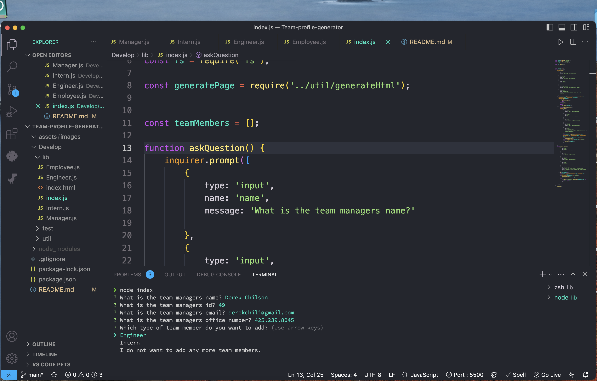
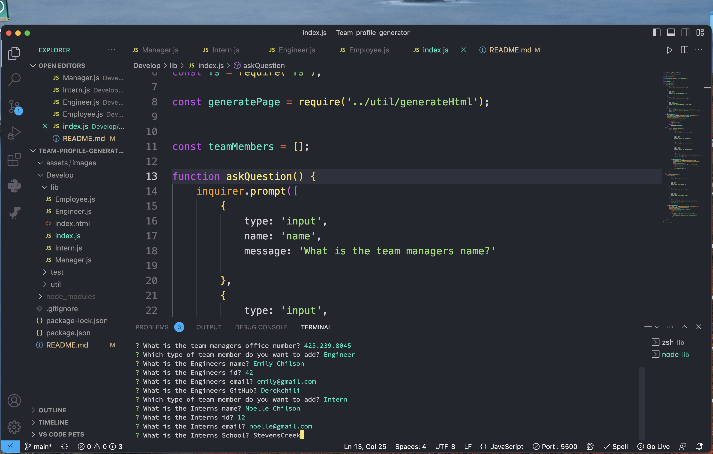
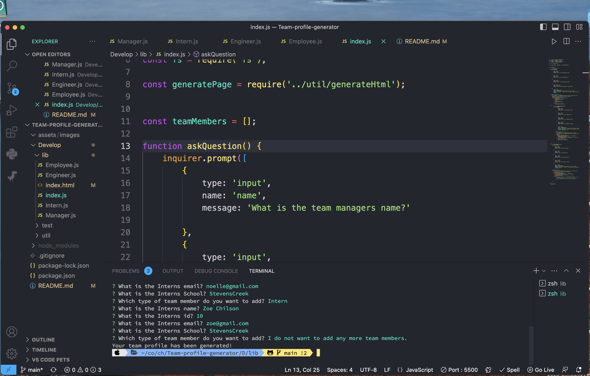
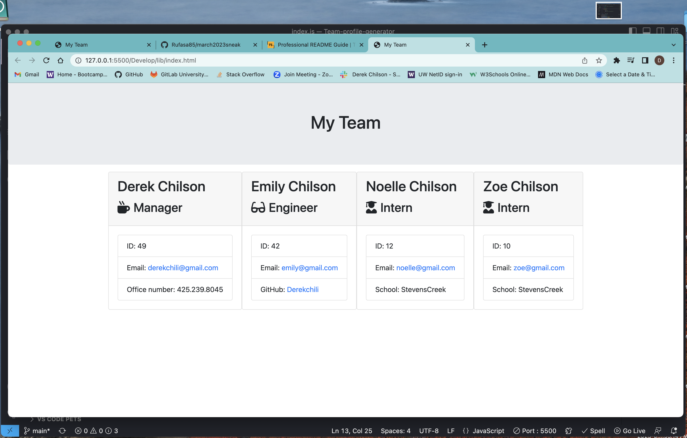

# Team-profile-generator

## Description
This is app that you will use the nodeJS command line, that will take in employee information for a software engineer team and generates cards with their information on it so you can access it quickly when you need it.

## Usage
When you are in the js file you open a integrated terminal and type node filename. It will then start asking questions about each person in you group and their name, email, github, id, school and office number. Then it will produce a HTML page for you that you can open and see the results.

Here is the video link, github repo link and some screenshots to show you how to use this app.

Video: https://drive.google.com/file/d/1xyrsejhxi40lI2ZleUFBqNajObnVytpb/view

Github: https://github.com/Derekchili/Team-profile-generator.git

## Credits
Tutor Andres Jiminez and TA Matt Todor helped me get the last few things done. Matt also helped me reading the test cases a lot and how to navigate them easier.

